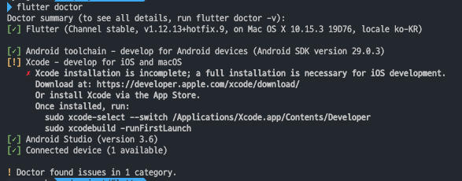
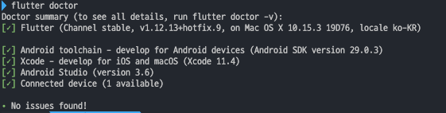
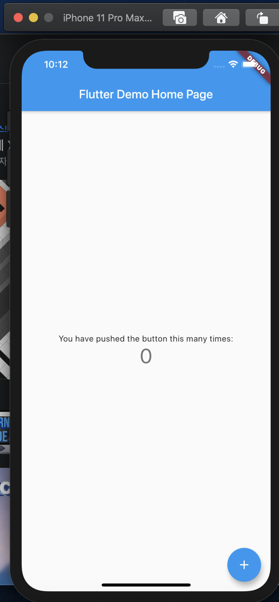

## Flutter Setting
`Flutter` 를 사용하려면 `Android Studio` 와 `Xcode` 가 둘다 설치가 되어있어야하고  
`Android Studio` 같은경우 `plugin` 에서 `flutter sdk` 를 별도 설치를 해야만 한다. 
  
`vscode` 에서 `flutter` 를 사용하기 위해선 `flutter plugin` 을 설치해주고 터미널에서 `flutter doctor`를 실행하면 아래의 결과와 같이 통과된 사항과 부족한 부분을 친절하게 알려준다.

  
  
    
안내해준 문제를 해결하고 다시 `flutter doctor` 를 실행하면 아래와같이 모두 녹색 체크가 들어오면 통과된것이고 이제 `flutter` 코드를 작성하고 앱을 실행할 준비가 된것이다.

  

`vscode` 기준 상단에서 `디버그 => 디버깅시작` 또는 `F5` 를 눌러서 앱을 실행가능하고   
시뮬레이터는 `command + shoft + p` 를 눌러 `flutter: em` 을 입력하면 `flutter: Launch emulator` 를 선택하고 실행하고자하는 에뮬레이터를 선택해 주면 된다.  



## Flutter Start
`command + shoft + p` => `Flutter: New Project ` 를 입력하고 프로젝트명을 입력하면 새로운 프로젝트를 시작할 수 있다.  

프로젝트의 구조를 잡기 위해 lib 폴더에 새로운 폴더를 생성한다.
- `model` - 데이터베이스 모델과 관련된 파일들
- `screen` - 각 화면별 파일
- `widget` - 여러번 반복되거나 자주 사용될 파일

#### main.dart
``` dart
import 'package:flutter/material.dart';
import 'package:netflix_clone/widget/bottom_bar.dart';

void main() => runApp(MyApp());

class MyApp extends StatefulWidget {
  _MyAppState createState() => _MyAppState();
}

class _MyAppState extends State<MyApp> {
  TabController controller;
  @override
  Widget build(BuildContext context) {
    return MaterialApp(
      title: 'testflix',
      theme: ThemeData(
        brightness: Brightness.dark, 
        primaryColor: Colors.black,
        accentColor: Colors.white,
      ),
      home: DefaultTabController(
        length: 4 , 
        child: Scaffold(
          body: TabBarView(
            physics: NeverScrollableScrollPhysics(),
            children: <Widget>[
              Container(child: Center(child: Text('home'),),), 
              Container(child: Center(child: Text('search'),),), 
              Container(child: Center(child: Text('save'),),), 
              Container(child: Center(child: Text('more'),),),
            ],
          ),
          bottomNavigationBar: Bottom(),
        )
      )
    );
  }
}
```

우선 강의를보고서 코드를 작성하고 작성된 코드를 따로 시간내어 정리하면서 학습을 진행해가려고 한다. 강의 영상에서는 추가적인 상세한 설명업싱 바로바로 코드를 짜면서 진행하기때문에 꼭 필요한 과정이다.  

우선 플러터는 모든것이 Widget으로 시작하고 동작한다.  

``` dart
void main() => runApp(MyApp());
```
`MyApp() `이라는 커스텀 위젯을 제일 처음 실행할 위젯으로 잡는다.
  
``` dart
// 스크린 레이아웃을 빌드하는 역할을 한다.
class MyApp extends StatefulWidget {
    // Framework가 StatefulWidget 을 만들경우 createState() 가 즉시 호출된다.
  _MyAppState createState() => _MyAppState();
}
```
`Flutter` 의 `Widget` 은 `StatelessWidget` 과 `StatefulWidget` 를 상속 받아 만들 수 있다.  
  
`Widget` 은 `Build` 메서드를 포함하며, 이 `Build` 메서드를 이용해서 `Layer Tree` 를 만든다.
  
`StatelessWidget` 은 `단 한번 만 Build` 과정이 일어난다. 때문에, 한번 그려진 화면은 계속 유지되며, 성능 상 장점이 생긴다.
  
`StatefulWidget` 은 `state` 를 포함하며, `setState` 가 발생할때마다 다시 `Build` 과정이 일어난다. 때문에, 동적 화면을 쉽게 구현이 가능하다.

#### createState()
`createState()` 함수는 `buildContext`가 `state`에 할당되게 된다.

#### TabController controller
Tab을 사용하기 위해서는 선택된 탭과 컨텍트 세션이 동기화가 되어야 하는데 이러한 작업을 해주는 역할을 한다.

#### Widget build(BuildContext context) {}
위젯마다 하나씩 갖게되고 빌드된 모든 위젯 트리구조 내의 위젯 위치에대한 참조이다.   
만약 위젯 A가 하위 위젯을 갖고 있다면 위젯 A의 `BuildContext` 는 하위 `BuildContext`의 상위 `BuildContext` 가 된다

#### return MaterialApp()
`Material` 디자인을 사용할 수 있다. 일반적으로 필요한 여러 위젯을 래핑 할 수 있다.
- `title`: 이 속성은 응용 프로그램에 대한 간단한 설명을 사용자에게 제공하는데 사용. 사용자가 모바일에서 최근 앱버튼 을 누르면 제목으로 표시됨  
- `theme`: 이 특성은 애플리케이션의 테마 색상과 같은 애플리케이션에 기본 테마를 제공. 이를위해 `ThemeData()` 라는 내장 클래스 / 위젯을 사용

#### DefaultTabController()
 TabBar 또는 TabBarView 와 TabController 를 공유하는 데 사용되는 상속 된 위젯
 - length: 탭의 갯수를 지정
 - child: 위젯 아래의 위젯
 - NeverScrollableScrollPhysics(): 화면을 터치하여 물리적으로 슬라이드를 이동할수 없도록 막는것
 - BottomNavigationBar: 일반적으로 3~5 사이의 적은 수의 뷰 중에서 선택하기위해 앱 하단에 표시되는 머티어리얼 위젯이다.

## 참고
[Flutter 공식문서](https://flutter.dev/docs/get-started/install/macos)  
[mac 에 vscode 로 Flutter 설치하기](https://skuld2000.tistory.com/83)